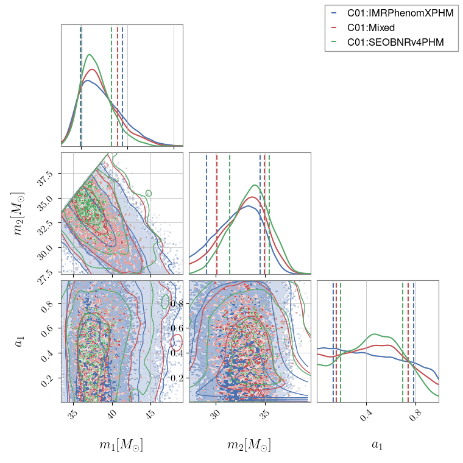

============
Corner plots
============

`pesummary` has implemented an extension of the
`corner.corner <https://corner.readthedocs.io/en/latest/>`_
method to allow for further customisation, see below for details.

KDEs rather than histograms
---------------------------

The `pesummary` implementation of the :code:`corner.corner` plot allows for
the user to show (custom) KDEs along the leading diagonal, as well as custom
KDEs in the 2D panels. The latter is particularly useful when the posterior
distributions are railing against known physical boundaries, and the standard
method smooths across these boundaries. Below we show how to plot KDEs along
the leading diagonal, as well as using custom KDEs. For more details about
custom KDEs implemented in `pesummary`, see
`Bounded KDEs <../core/bounded_kdes.html>`_.

KDEs can be plotted along the leading diagonal by simply passing the KDE
method you wish to use to the `pesummary` wrapper of :code:`corner.corner`.
For instance, if we wish to use the :code:`stats.gaussian_kde` method,

.. code-block:: python

    from pesummary.core.plots.corner import corner
    import numpy as np
    from scipy import stats

    xs = np.array([np.random.normal(0., 0.5, size=10000), np.random.normal(0., 0.5, size=10000)])
    fig = corner(xs.T, ["x", "y"], kde=stats.gaussian_kde, hist_kwargs={"density": True})
    fig.show()

.. image:: ./examples/kde_corner.png

Likewise, if we wish to use a custom KDE for the 2D panels, we can provide
this to the `pesummary` wrapper of :code:`corner.corner`. For instance,
if we wish to plot the posterior of GW150914, where the primary mass is always
larger than the secondary, and the primary spin is bounded between 0
and 1, we can use the following,

.. code-block:: python

    from pesummary.core.plots.corner import corner
    from pesummary.gw.plots.publication import _return_bounds
    from pesummary.gw.fetch import fetch_open_samples
    from pesummary.utils.bounded_2d_kde import Bounded_2d_kde
    from pesummary.utils.bounded_1d_kde import bounded_1d_kde

    samples = fetch_open_samples("GW150914").samples_dict
    transform, xlow, xhigh, ylow, yhigh = _return_bounds(["mass_1", "mass_2"])
    fig = samples.plot(
        parameters=["mass_1", "mass_2", "a_1"], type="corner",
        kde=bounded_1d_kde, kde_2d=Bounded_2d_kde, bins=100,
        hist_kwargs={"density": True},
        kde_kwargs={"a_1": {"xlow": 0., "xhigh": 1.}},
        kde_2d_kwargs={
            "mass_1": {"low": xlow, "high": xhigh},
            "mass_2": {"low": ylow, "high": yhigh, "transform": transform},
            "a_1": {"low": 0., "high": 1.}
        }
    )
    fig.show()

